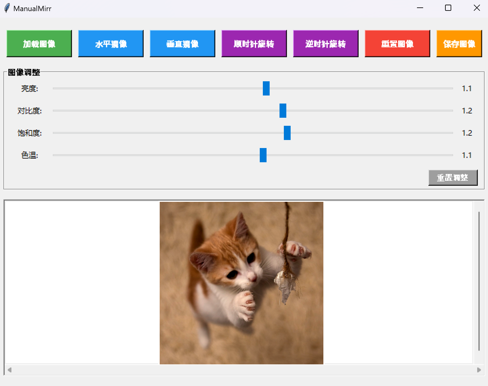

# **ManualMirr**

***One-click batch rotation, mirroring, and adjustment of brightness, contrast, saturation, and color temperature for all photos in a folder.***

## Introduction

This is a simple yet powerful image mirroring processing tool developed using Python's tkinter and PIL libraries, supporting Python 3.7 and above. Before using, please install the relevant dependencies according to `requirements.txt`. The tool allows users to perform horizontal or vertical mirroring effects, rotation, and adjustments of brightness, contrast, saturation, and color temperature on single or batch photos. It is particularly suitable for batch processing of photos in scientific research, fieldwork, surveying, and exploration scenarios.

## Features

- Load image files in various formats (PNG, JPG, JPEG, BMP, GIF)
- Adjust brightness, contrast, saturation, and color temperature
- Apply horizontal mirroring effect
- Apply vertical mirroring effect
- Rotate images clockwise and counterclockwise
- Reset images to their original state
- Save processed images locally
- Automatically adjust image size to fit the window
- User-friendly interface

## Usage

1. Install dependencies:
```pip install -r requirements.txt```
2. Double-click to run: `run.bat`, open the program

3. Click the "Load Image" button to choose whether to process a single photo or batch process all photos in a folder

4. Move the "Brightness", "Contrast", "Saturation", "Color Temperature" sliders to adjust the respective parameters, default value is `1`, adjustment range is `0-2`
5. Click the "Rotate Clockwise" or "Rotate Counterclockwise" button to rotate the image
6. Use the "Horizontal Mirror" or "Vertical Mirror" button to apply the corresponding effect


8. Click the "Save Image" button to save the processed image locally
9. To restore the original image, click the "Reset Image" button

## Notes

- **Note: Adjust "Brightness", "Contrast", "Saturation", "Color Temperature" first, then perform subsequent mirroring and rotation operations.~~Why? Try it and you'll know~~**


# In Chinese


# **ManualMirr** 图像处理工具

***一键批量旋转、镜像，以及调整文件夹中所有照片的亮度、对比度、饱和度和色温。***

## 介绍

这是一个简单而强大的图像镜像处理工具，使用Python的tkinter和PIL库开发，支持Python 3.7及以上版本，使用前请先根据`requirements.txt`安装相关依赖。该工具允许用户对单张或批量照片进行水平或垂直镜像效果、旋转，以及亮度、对比度、饱和度和色温的调整。特别适合于科学研究、野外工作、测量和探险场景中的照片批量处理。

## 功能

- 加载各种格式的图像文件（PNG、JPG、JPEG、BMP、GIF）
- 调整亮度、对比度、饱和度和色温
- 应用水平镜像效果
- 应用垂直镜像效果
- 顺时针和逆时针旋转图像
- 将图像重置为原始状态
- 本地保存处理后的图像
- 自动调整图像大小以适应窗口
- 用户友好的界面

## 使用方法

1. 安装依赖：
```pip install -r requirements.txt```
2. 双击运行：`run.bat`，打开程序

3. 点击“加载图像”按钮，选择处理单张照片或批量处理文件夹中的所有照片

4. 移动“亮度”、“对比度”、“饱和度”、“色温”滑块以调整相应参数，默认值为`1`，调整范围为`0-2`
5. 点击“顺时针旋转”或“逆时针旋转”按钮旋转图像
6. 使用“水平镜像”或“垂直镜像”按钮应用相应效果


8. 点击“保存图像”按钮将处理后的图像保存到本地
9. 要恢复原始图像，请点击“重置图像”按钮

## 注意事项

- **注意：先调整“亮度”、“对比度”、“饱和度”、“色温”，然后再进行后续的镜像和旋转操作。~~为什么？试试你就知道~~**
